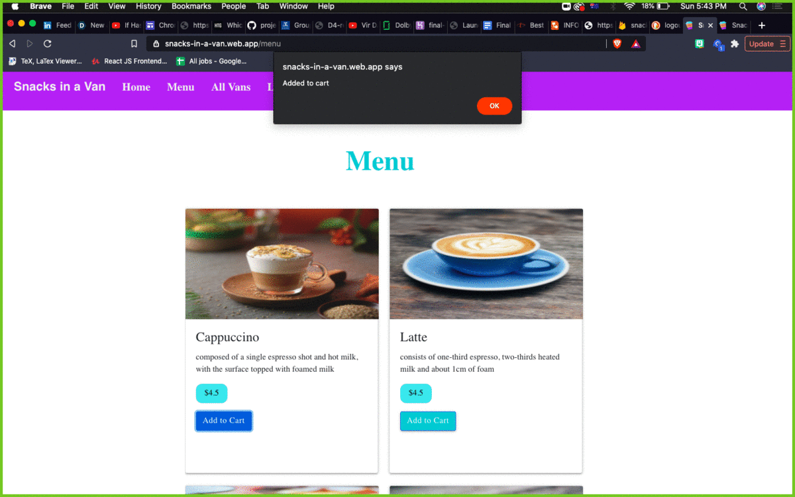
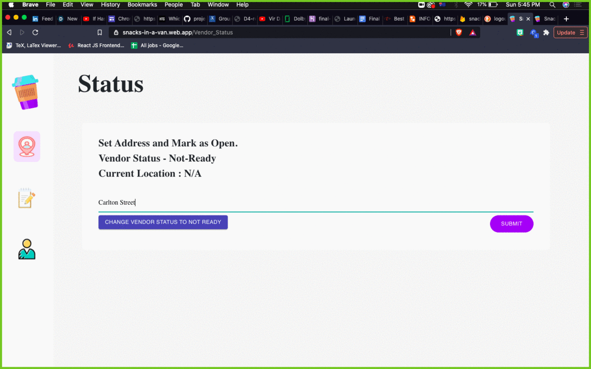

**The University of Melbourne**

# INFO30005 – Web Information Technologies

# Group Project Repository

## Snacks in a Van deployed Application on Heroku and Firebase

Frontend - https://snacks-in-a-van.web.app

Backend - https://final-snacks-backend.herokuapp.com/

Commit ID - db9786eb6a156d71fd612c0640a50a1d1777cd30

## Dummy Login or you can Register

Customer login details:
email: dummy@gmail.com
password: dummy123

Vendor login details:
email: Tomato Town
password: town123

## Running our application on Local Server

### Running Frontend

```yaml
cd client
npm install
npm start
```

### Running Backend

Before running backend please change all the links to localhost:3000 in frontend so as to connect all the axios calls.

```yaml
cd api
npm install
npm start
```

## Table of contents

- [Team Members](#team-members)
- [General Info](#general-info)
- [Technologies](#technologies)
- [Code Implementation](#code-implementation)
- [Adding Images](#adding-images)

## Team Members

| Name            |            Task             | State |
| :-------------- | :-------------------------: | ----: |
| Pulkit Aggarwal |         Full Stack          |  Done |
| Girish Madnani  |         Full Stack          |  Done |
| Shubham Singh   |      FrontEnd, Report       |  Done |
| Siwen Gao       | UI Design, Frontend, Report |  Done |
| Ruoxi Feng      | UI Design, Frontend, Report |  Done |
| Kang de Liang   |   Entire Vendor Frontend    |  Done |

## General info

For this project, we didn't have much experience with React.JS and Node.Js and all
of us had to learn the technologies from scratch. This project was basically building a customer-vendor platform for a Food Truck company. It definitely helped us learn a lot of the technologies we had never used before.

Please try our Vendor application on Ipad pro to get a better experience.

## Technologies

Project is created with:

- NodeJs 14.16.0
- React.JS 2.33
- Heroku
- Firebase
- MongoDB
- Express.JS
- Redux

## Adding Images

Here's a small brief of how adding `Orders` work in our application

- Menu to Cart
- Cart to Order
- Cancel order Page
- Feedback Page

<p align="center">
  
</p>

Here's a small brief of how `Vendors` work in our application

- Vendor Status can be changed and displayed
- Vendor Orders (Outstanding, Fulfilled, Picked up or completed)

<p align="center">
  
</p>

**Done with all of these tasks:**

- [x] Read the Project handouts carefully
- [x] User Interface (UI)mockup
- [x] App server mockup
- [x] Front-end + back-end (one feature)
- [x] Complete system + source code
- [x] Report on your work(+ test1 feature)

NOTE: Shared invite for database with Greg Wadley.
If you need access feel free to email [pulkit@student.unimelb.edu.au](mailto:pulkit@student.unimelb.edu.au)

## License
[MIT](https://choosealicense.com/licenses/mit/)
